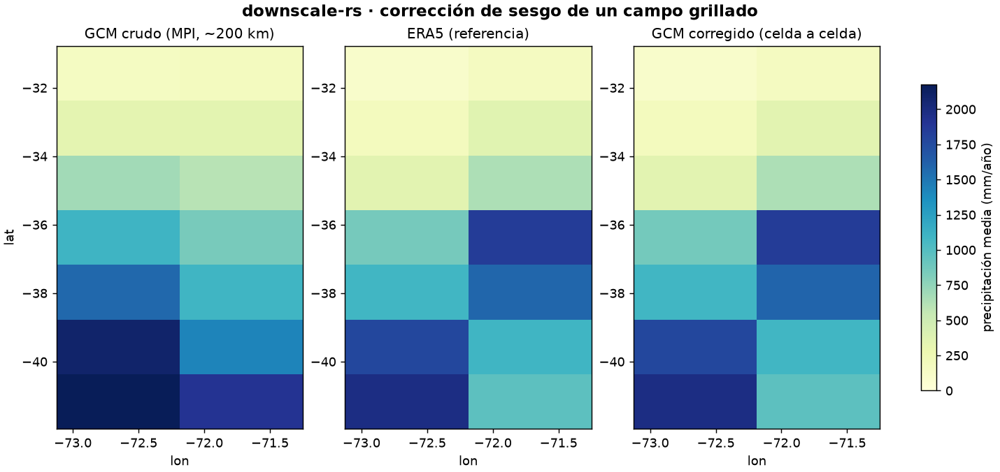

# Corrección de sesgo de campos grillados

Fecha: 2026-06-20. Núcleo: `downscale_core::grid::correct_grid`. Binding:
`downscale_rs.correct_grid`. Demostración: `scripts/experiment_grid.py`.

## Diseño

Los demás experimentos corrigen series puntuales (estaciones). El caso de
uso raster —corregir el sesgo de un **campo completo**, no solo puntos— se
resuelve manteniendo la disciplina del motor:

- **El núcleo hace el cómputo, sin I/O.** `correct_grid` recibe la grilla
  temporal aplanada `[n_time × n_cells]` (row-major) y corrige cada celda de
  forma independiente con quantile mapping. Las celdas con algún valor no
  finito (mar, máscara, dato faltante) salen `NaN` sin tocar — la máscara
  espacial se preserva. Las celdas son independientes: el cómputo es
  trivialmente paralelizable.
- **Las superficies hacen el I/O.** El binding Python acepta y devuelve
  arrays `[time, lat, lon]`, de modo que **xarray** maneja el NetCDF/GeoTIFF:

  ```python
  import xarray as xr, downscale_rs as ds
  obs   = xr.open_dataarray("cr2met_pr.nc")     # [time, lat, lon]
  model = xr.open_dataarray("gcm_pr.nc")
  corr  = ds.correct_grid(obs.values, model.values, kind="mult")
  xr.DataArray(corr, coords=model.coords, dims=model.dims).to_netcdf("corr.nc")
  ```

## Demostración con un campo real

Precipitación diaria del GCM CMIP6 crudo MPI-ESM1-2-LR (~200 km, Pangeo
zarr) sobre una ventana de Chile central-sur (7×2 celdas, 1980–2014),
corregida celda por celda hacia ERA5 (descargado en bulk en los centroides
de las celdas del GCM). El campo se trata como `[time, lat, lon]`; la
corrección es distribucional por celda (el GCM no se parea en el tiempo).



El GCM crudo sobreestima la precipitación en el sur húmedo (celda inferior
> 2000 mm/año); el campo corregido adopta la estructura espacial de ERA5
celda por celda, preservando el gradiente latitudinal seco-húmedo de Chile.
El **sesgo areal medio cae de +115 a −2 mm/año**.

## Lectura para el paper (EMS)

Cierra la brecha entre el motor (hasta aquí, series puntuales) y el caso de
uso raster del propósito declarado. La arquitectura —núcleo Rust sin I/O +
xarray para el grillado— corrige campos completos sin reimplementar la
lectura de NetCDF/GeoTIFF, reusando el ecosistema científico para el I/O y
Rust para el cómputo determinista. Escala a grillas grandes (cada celda es
independiente) y respeta la máscara de mar.
